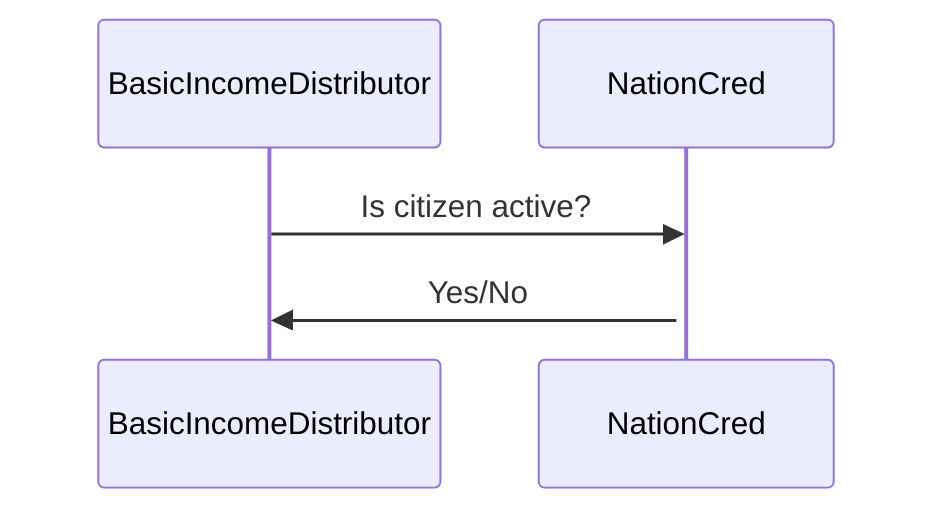

# N3BI

Nation3 Basic Income (N3BI)

## North Star Metric

Metric: Number of [_active_](https://github.com/nation3/nationcred-datasets/tree/main/nationcred#definition-of-active) citizens.

## Research Summary

https://app.clarity.so/nation3-public/docs/6fdd30ab-c6e3-4faa-942f-7a7a9a0cab16

## Functionality

### Two Smart Contracts

### Eligibility Based on NationCred

The [`NationCred.sol`](https://github.com/nation3/nationcred-contracts/blob/main/contracts/NationCred.sol) smart contract contains code for getting the citizen activity status for a given passport ID.

At the end of each week, Nation3's NationCred smart contract will be automatically updated with the list of citizens that are eligible.

### Enrollment

A Nation3 citizen can only be enrolled if the following prerequisites are in place:

1. The account owns a passport NFT
1. The passport has not expired
1. The passport is not about to expire within the next year
1. The citizen is [active](https://github.com/nation3/nationcred-datasets/tree/main/nationcred#definition-of-active)

Once eligible, the citizen can enroll for Basic Income, as long as the smart contract contains enough funding for 
covering one additional citizen's Basic Income for the duration of 1 year.

### Claiming

Once enrolled, citizens can claim their earned Basic Income at any time.

After 1 year, the enrollment will expire. And additional Basic Income can only be claimed after re-enrolling for 
another year.
