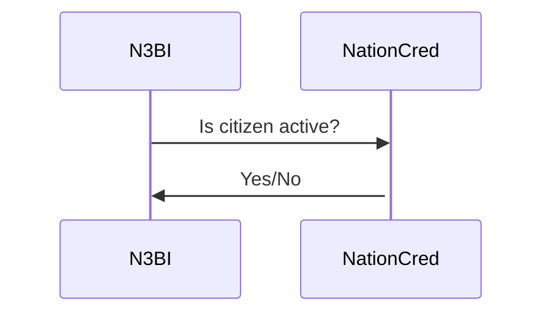

# N3BI

Basic Income for Nation3 Citizens

## North Star Metric

Metric: Number of _active_ citizens.
 - Current: 16 citizens voted in the last Snapshot proposal ([N3GOV-17](https://vote.nation3.org/#/proposal/0x7528849e1ca24eb55b88834f9d7e5f3a0f249015f66213c4c59ef9718c4f9adf)).
 - Goal: Grow to 50 active citizens by the end of Q4 2022.

## Functionality

### Two Smart Contracts

### Eligibility Based on NationCred

The NationCred smart contract contains code for getting the NationCred rank of an Ethereum account.

Each week/month, Nation3's NationCred maintainers will manually update the list of addresses that are eligible.

### Enrollment

A Nation3 citizen can only be enrolled if the following prerequisistes are in place:

1. The account has a passport NFT
1. The passport has not expired
1. The passport is not about to expire within the next year
1. The NationCred is active

Once eligible, the citizen can enroll for Basic Income, as long as the smart contract contains enough funding for 
covering one additional citizen's Basic Income for the duration of 1 year.

### Claiming

Once enrolled, citizens can claim their earned Basic Income at any time.

After 1 year, the enrollment will expire. And additional Basic Income can only be claimed after re-enrolling for 
another year.
